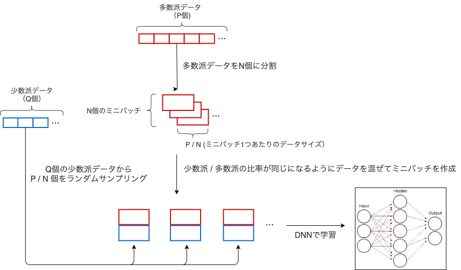

# 不均衡データ分類問題をDNNで解くときの under sampling + bagging 的なアプローチ

[元論文](https://users.cs.fiu.edu/~chens/PDF/ISM15.pdf)

[解説記事](https://devblog.thebase.in/entry/2020/02/29/110000)

ベースとなるアプローチは下記3つに大別される．  

|Approach|Pros|Cons|
|-|-|-|
アンダーサンプリング|多数派データをランダムに減らす|情報損失が生じる
オーバーサンプリング|少数派を増やす|少数派データの水増しによる過学習が生じる
損失関数のカスタマイズ|損失関数に対して多数派データのコストを少数派データとの割合に応じて割り引くなど|過学習になりうる

論文では，ミニバッチ作成時にラベルごとのサンプルサイズを合わせる方法を提案している． 



1. $P$個の多数派データを$N$個のバッチサイズに分割してミニバッチ化
2. `for i in range(N):` $Q$個の少数派データから$P/N$個非復元抽出し，$i$個目のミニバッチに混ぜる．  
これにより，ラベルの比率が均等な$N$個のミニバッチが作られる．  

注意: 非復元抽出により，ミニバッチ単体で見ればデータの重複はないが，別のミニバッチを作るときはバッチ全体としては少数派データの重複が発生する．

## PyTorch実装例
```python
class BinaryBalancedSampler:
    def __init__(self, features, labels, n_samples):
        self.features = features
        self.labels = labels 
        
        label_counts = np.bincount(labels)
        major_label = label_counts.argmax()
        minor_label = label_counts.argmin()
        
        self.major_indices = np.where(labels == major_label)[0]
        self.minor_indices = np.where(labels == minor_label)[0]
        
        np.random.shuffle(self.major_indices)
        np.random.shuffle(self.minor_indices)
        
        self.used_indices = 0
        self.count = 0
        self.n_samples = n_samples
        self.batch_size = self.n_samples * 2

    def __iter__(self):
        self.count = 0
        while self.count + self.batch_size < len(self.major_indices):
            # 多数派データ(major_indices)からは順番に選び出し
            # 少数派データ(minor_indices)からはランダムに選び出す操作を繰り返す
            indices = self.major_indices[self.used_indices:self.used_indices + self.n_samples].tolist()\ 
                      + np.random.choice(self.minor_indices, self.n_samples, replace=False).tolist()
            yield torch.tensor(self.features[indices]), torch.tensor(self.labels[indices])
            
            self.used_indices += self.n_samples
            self.count += self.n_samples * 2
```