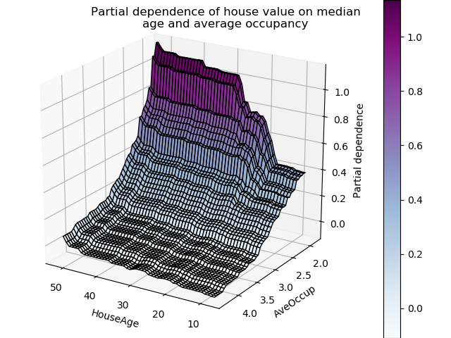
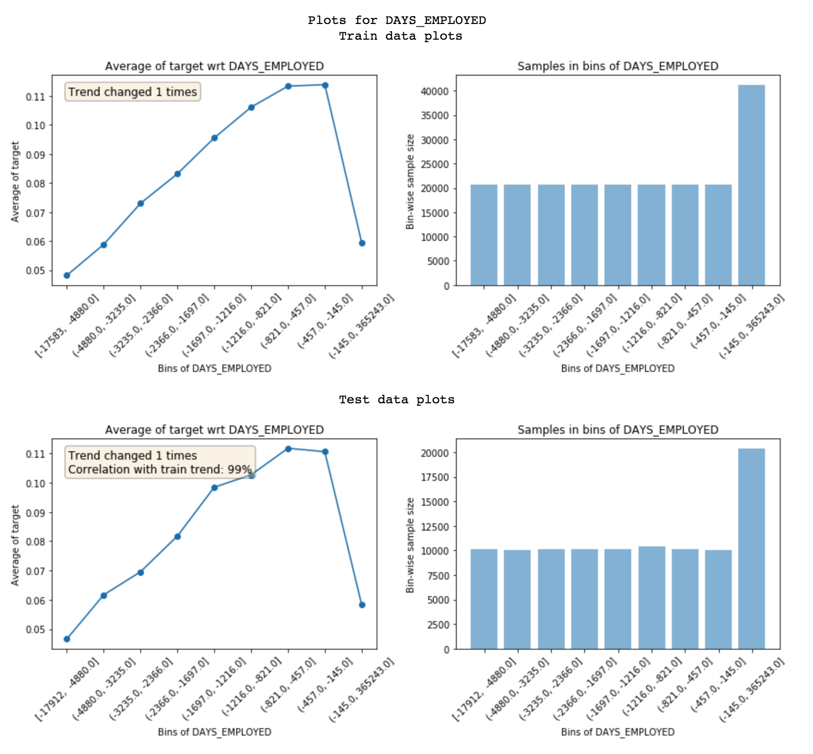
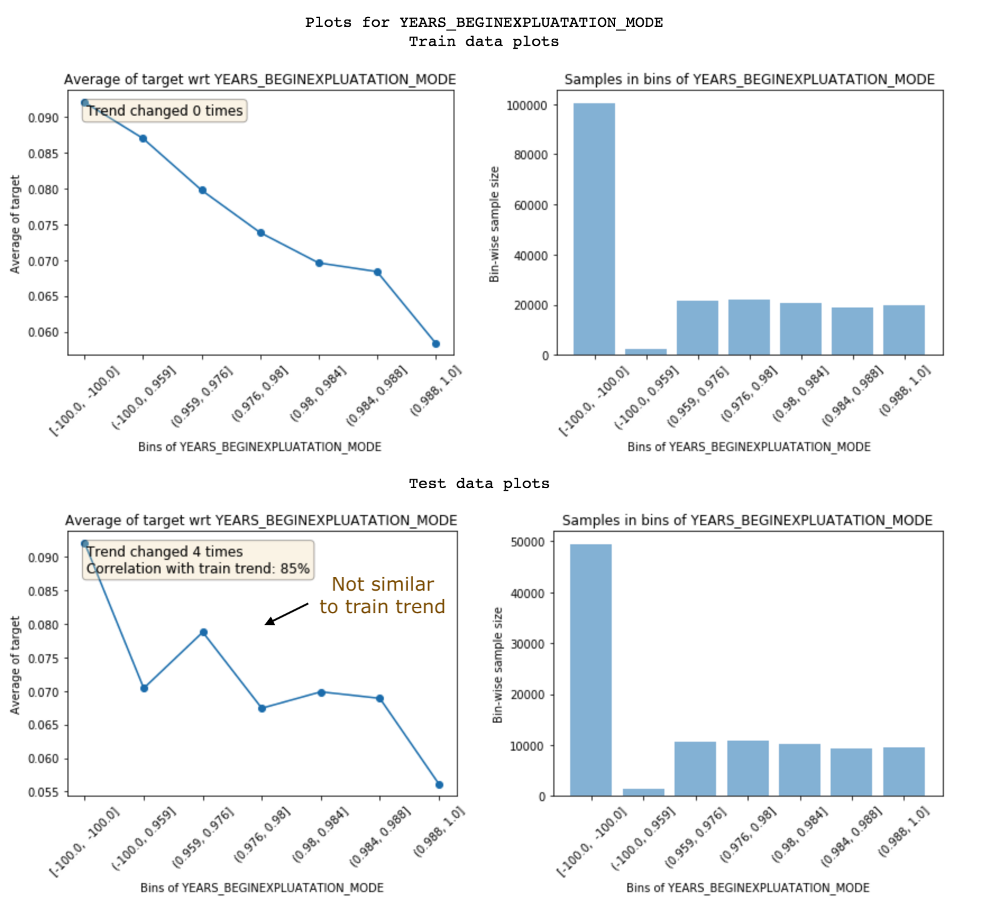
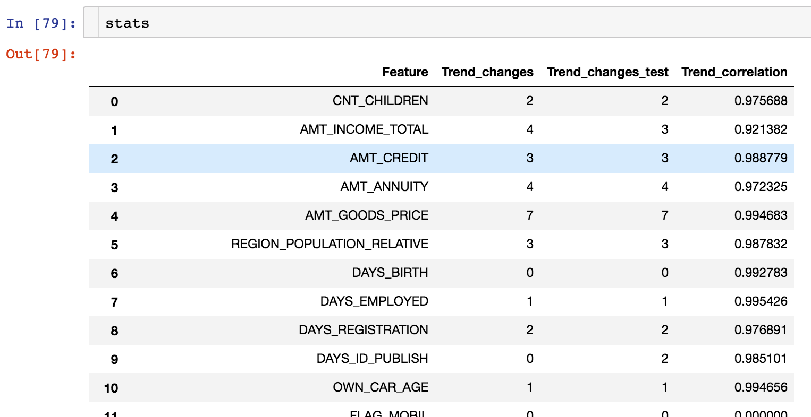
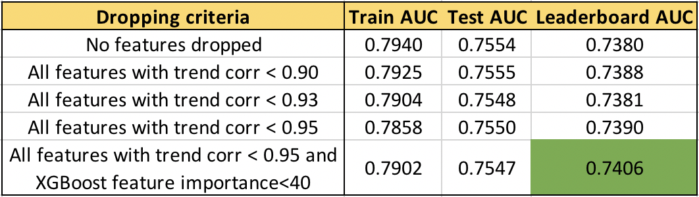
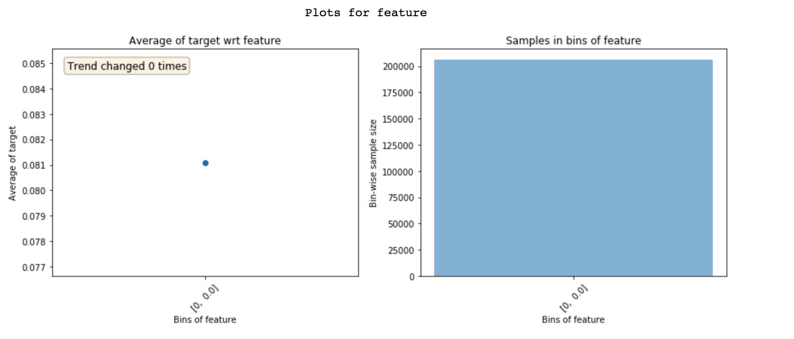
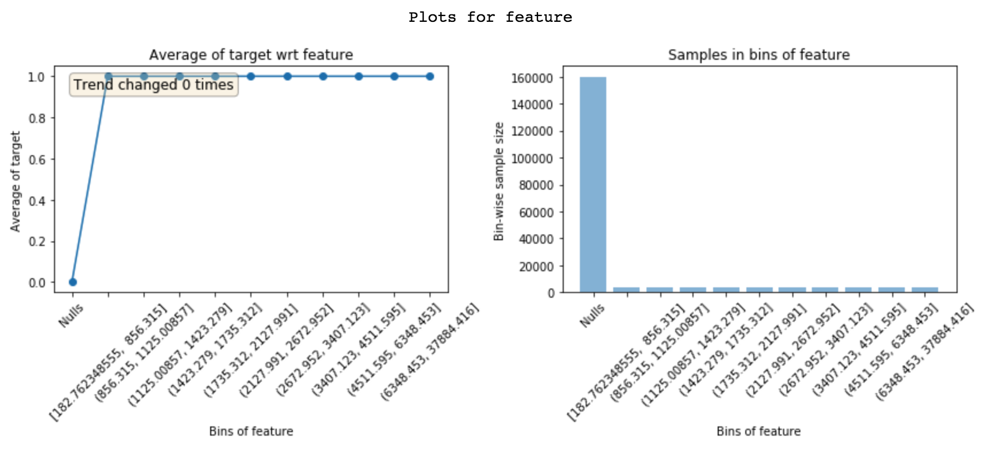

# My secret sauce to be in top 2% of a kaggle competition

[元記事](https://towardsdatascience.com/my-secret-sauce-to-be-in-top-2-of-a-kaggle-competition-57cff0677d3c)が(mediumでペイウォール付きなのでアーカイブ)

Competing in kaggle competitions is fun and addictive!  
And over the last couple of years, I developed some standard ways to explore features and build better machine learning models.  
These simple, but powerful techniques helped me get a top 2% rank in Instacart Market Basket Analysis competition and I use them outside of kaggle as well.  
So, let’s get right into it!  
One of the most important aspects of building any supervised learning model on numeric data is to understand the features well.  
__Looking at partial dependence plots of a model helps you understand how the model’s output changes with any feature__.



But, the problem with these plots is that they are created using a trained model.  
If we could create these plots from train data directly, it could help us understand the underlying data better.  

In fact, it can help you with all the following things:
1. Feature understanding
2. Identifying noisy features (the most interesting part!)
3. Feature engineering
4. Feature importance
5. Feature debugging
6. Leakage detection and understanding
7. Model monitoring  

これらのテクニックはこの記事と`featexp`パッケージ([github](https://github.com/abhayspawar/featexp))にまとめられている．  
We’ll use the application dataset from Home Credit Default Risk competition on Kaggle.  
The task of the competition is to predict defaulters using the data given about them.

## Feature understanding  

If dependent variable (target) is binary, scatter plots don’t work because all points lie either at 0 or 1.  
For continuous target, too many data points make it difficult to understand the target vs feature trend.  
`featexp` creates better plots which help with this problem.  
Let’s try it out!

```python
from featexp import get_univariate_plots

# Plots drawn for all features if nothing is passed in feature_list parameter.
get_univariate_plots(data=data_train, target_col='target', 
                     features_list=['DAYS_BIRTH'], bins=10)
```

vsターゲットプロット.png)

`featexp` creates equal population bins (X-axis) of a numeric feature.  
It then calculates target’s mean in each bin and plots it in the left-hand side plot above.  
In our case, target’s mean is nothing but default rate.  
The plot tells us that customers with high negative values for DAYS_BIRTH (higher age) have lower default rates.  
This makes sense since younger people are usually more likely to default.  
These plots help us understand what the feature is telling about customers and how it will affect the model.  
The plot on the right shows number of customers in each bin.

## Identifying noisy features

Noisy features lead to overfitting and identifying them isn’t easy.  
In featexp, you can pass a test set and compare feature trends in train/test to identify noisy ones.  
This test set is not the actual test set.  
Its your local test set/validation set for which you know target.  

```python
get_univariate_plots(data=data_train, target_col='target', data_test=data_test, features_list=['DAYS_EMPLOYED'])  
```


`featexp`はノイズを計測するのに役立つ2つの指標を計算・描画する．  

1. トレンドの相関(testのプロット)  
If a feature doesn’t hold same trend w.r.t. target across train and evaluation sets, it can lead to overfitting.  
This happens because the model is learning something which is not applicable in test data.  
Trend correlation helps understand how similar train/test trends are and mean target values for bins in train & test are used to calculate it.  
Feature above has 99% correlation.  
Doesn’t seem noisy!

2. トレンドの変化  
突然かつ繰り返すトレンドの変化はノイズを含む可能性がある．  
But, such trend change can also happen because that bin has a very different population in terms of other features and hence, its default rate can’t really be compared with other bins.

Feature below is not holding the same trend and hence, has a low trend correlation of 85%.  
These two metrics can be used to drop noisy features.  



Dropping low trend-correlation features works well when there are a lot of features and they are correlated with each other.  
過学習の抑制や，他の相関した特徴による情報損失の回避が期待できる．  
It’s also important to not drop too many important features as it might lead to a drop in performance.  
__Also, you can’t identify these noisy features using feature importance because they could be fairly important and still be very noisy!__  

Using test data from a different time period works better because then you would be making sure if feature trend holds over time.  

`get_trend_stats()` function in featexp returns a dataframe with trend correlation and changes for each feature.

```python
from featexp import get_trend_stats
stats = get_trend_stats(data=data_train, target_col='target', data_test=data_test)
```



Let’s actually try dropping features with low trend-correlation in our data and see how results improve.  



__We can see that higher the trend-correlation threshold to drop features, higher is the leaderboard (LB) AUC__.  
Not dropping important features further improves LB AUC to 0.74.  
It’s also interesting and concerning that test AUC doesn’t change as much as LB AUC.  
Getting your validation strategy right such that local test AUC follows LB AUC is also important.  
Whole code can be found in featexp_demo notebook.  

## Feature Engineering

The insights that you get by looking at these plots help with creating better features.  
Just having a better understanding of data can lead to better feature engineering.  
But, in addition to this, it can also help you in improving the existing features.  
Let’s look at another feature `EXT_SOURCE_1`:

vsターゲット.png)

Customers having a high value of EXT_SOURCE_1 have low default rates. 
But, the first bin (~8% default rate) isn’t following the feature trend (goes up and then down).  
It has only negative values around -99.985 and a large population.  
This probably implies that these are special values and hence, don’t follow the feature trend.  
Fortunately, non-linear models won’t have a problem learning this relationship.  
But, for linear models like logistic regression, such special values and nulls (which will be shown as a separate bin) should be imputed with a value from a bin with similar default rate instead of simply imputing with feature mean.  

## Feature importance  

Featexp also helps you with gauging feature importance.  
DAYS_BIRTH and EXT_SOURCE_1 both have a good trend.  
But, population for EXT_SOURCE_1 is concentrated in special value bin implying that feature has the same information for most of the customers and hence, can’t differentiate them well.  
This tells that it might not be as important as DAYS_BIRTH.  
Based on XGBoost model’s feature importance, DAYS_BIRTH is actually more important than EXT_SOURCE_1.

## Feature debugging  

Looking at Featexp’s plots helps you in capturing bugs in complex feature engineering codes by doing these two things:



1. 特徴のpopulation distributionが直感と合うかチェックする．  
バグにより上のような極限な例に出くわすことがよくある．  
I’ve personally encountered extreme cases like above numerous times due to minor bugs.

2. プロット前に常に特徴トレンドがどのようになるか仮説を立てる．  
特徴トレンドが直感と違っていたらそれはヒントである．  
__このプロセスが特にMLを面白くするものである．__

## Leakage Detection  

Data leakage from target to features leads to overfitting.  
Leaky features have high feature importance.  
But, understanding why leakage is happening in a feature is difficult.  
Looking at featexp plots can help you with that.  

The feature below has 0% default rate in ‘Nulls’ bin and 100% in all other bins.  
Clearly, this is an extreme case of leakage. This feature has a value only when the customer has defaulted.  
Based on what the feature is, this could be because of a bug or the feature is actually populated only for defaulters (in which case it should be dropped).  
__Knowing what the problem is with leaky feature leads to quicker debugging.__  



## Model Monitoring

Since featexp calculates trend correlation between two data sets, it can be easily used for model monitoring.  
Every time the model is re-trained, the new train data can be compared with a well-tested train data (typically train data from the first time you built the model).  
Trend correlation can help you monitor if anything has changed in feature w.r.t. its relationship with target.  

Doing these simple things have always helped me in building better models in real life and on kaggle.  
With featexp it takes 15 minutes to look at these plots and it’s definitely worth it as you won’t be flying blind after that.  

If you liked this, you might like [my other post](https://tech.instacart.com/predicting-real-time-availability-of-200-million-grocery-items-in-us-canada-stores-61f43a16eafe) on how Instacart built item availability model to predict real-time availability of items in grocery stores across US/Canada. :)